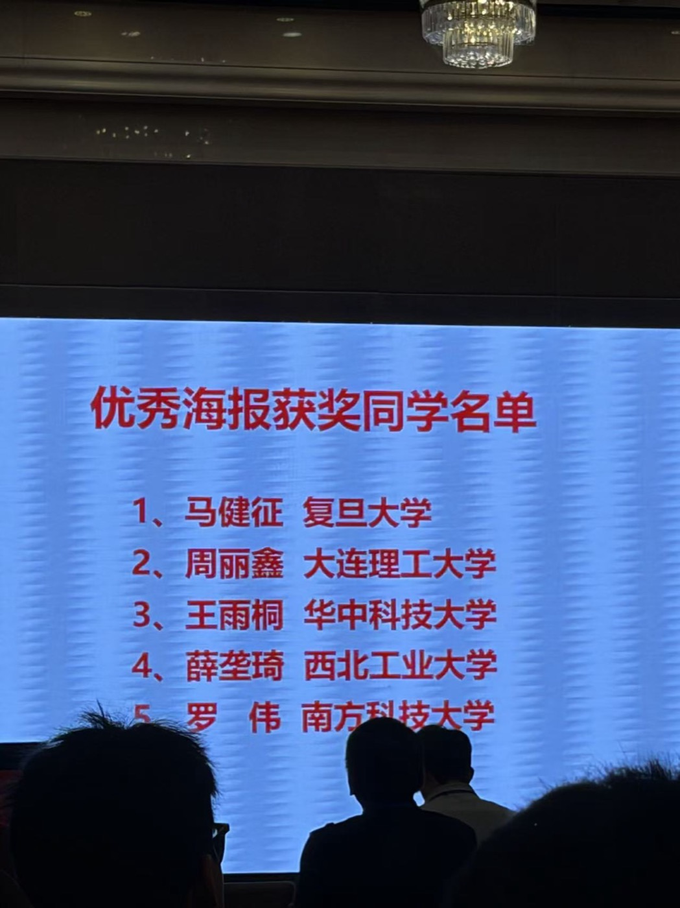

2026 年 7 月，课题组成员赴武汉参加中国材料大会2026，并在多个分会场开展学术交流。本次大会汇聚材料科学与工程领域的专家学者，围绕先进结构材料、功能材料、材料模拟计算、材料基因与人工智能材料等方向展示最新研究进展。

<!--more-->

会议期间，吴亚北分别在“结构材料热-动力学”会场和“材料模拟、计算与设计”会场作两个不同的邀请报告，介绍课题组在计算材料物理、第一性原理方法与智能材料设计方面的研究进展。

课题组学生也积极参与会议交流。崔潇文在“材料基因与人工智能材料”会场作口头报告，孙丽在“材料模拟、计算与设计”会场作口头报告；罗伟在“材料模拟、计算与设计”会场展示工作海报，并获优秀海报奖。

此次参会促进了课题组与国内材料计算、材料基因和结构材料热-动力学等方向同行的交流，也为学生展示研究成果、了解领域前沿和拓展学术视野提供了重要机会。
